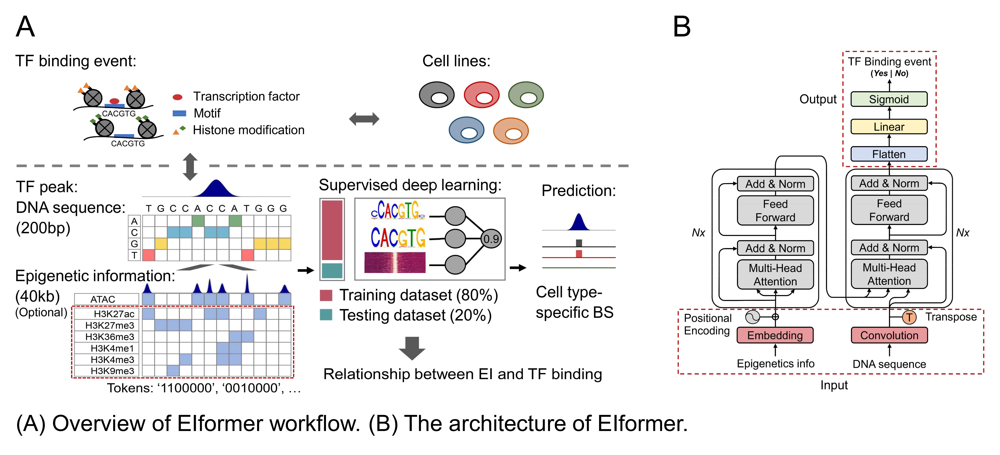

## Introduction

**EIformer** is a transformer-based neural network for trans-cell binding site prediction of DNA binding proteins.

## Requirements

- [Python](https://www.python.org/) (v3.9.16)
- matplotlib (v3.7.1)
- numpy (v1.22.3)
- pandas (v1.4.2)
- pyranges (v0.0.127)
- scipy (v1.10.1)
- seaborn (v0.12.2)
- [Tensorflow](https://www.tensorflow.org/) (v2.12.0)
- [NeuronMotif](https://github.com/wzthu/NeuronMotif) (Zheng Wei et al. PNAS. 2023)
- [FIMO](https://meme-suite.org/meme/doc/fimo.html?man_type=web) (v5.5.1)

## Training your EIformer model

As shown in introduction figure, EIformer employs an encoder-decoder architecture to extract features from input DNA sequence and epigenomic information (EI) and predict TF binding events in distinct cell lines. We have collected training datasets of 32 DNA binding proteins (DBPs) from [ENCODE project](https://www.encodeproject.org/) and trained corresponding models. The robust model weights are provided in *models* folder.

We also provide training scripts implemented in [Jupyter notebooks](https://jupyter.org/), with GM12878-CTCF serving as the example case. Training steps are as follow:

### Prepare dataset

*prepare_dataset.ipynb* performs this processing step. You need to prepare:

1. DBP binding site information (typically detected by ChIP-seq experiment with genomic coordinates determined by peak calling using [MACS2](https://github.com/macs3-project/MACS/wiki/Install-macs2) software);
2. Epigenetic profiles (ATAC-seq data is the minimum requirement, and other assays are optional).
3. Reference genome sequence, **hg38** and **mm10** are recommended, which can be downloaded from [GENCODE](https://www.gencodegenes.org/).

### Train model

*train_model.ipynb* is used for training and logging the corresponding weights files.

### Model interpretation

*explain_model.ipynb* executes this step with dual interpretability outputs:

1. DNA binding motif analysis;
2. Epigenetic context effects on protein binding.

### Make prediction

We have demonstrated that EIformer possesses cross-cell type predictive capability. Consequently, models trained on one or multiple cell types can be applied to predict binding event in unseen cell types. The *make_prediction.ipynb* script implements this functionality.

---

Additional methodological details are available in our publication [TBD].
